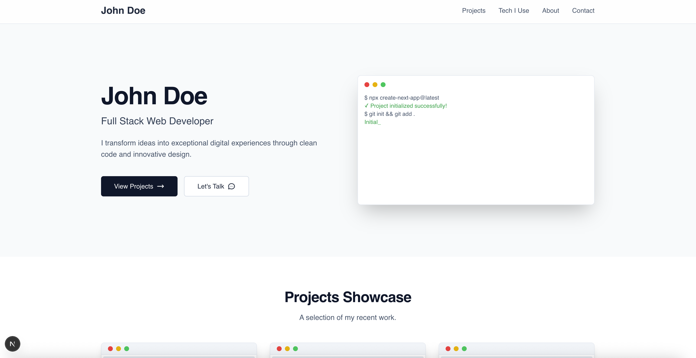

# My Web Developer Portfolio

This is a personal portfolio website built with Next.js and Tailwind CSS. It's designed to be a clean, modern, and easily updatable showcase of my projects, skills, and experience.



---

## 🚀 Getting Started

To get a copy of this project up and running on your local machine, follow these simple steps.

### Prerequisites

Make sure you have Node.js and npm installed on your machine. You can download them from [nodejs.org](https://nodejs.org/).

### Installation & Setup

1.  **Clone the repository:**
    ```bash
    git clone [https://github.com/your-username/your-repo-name.git](https://github.com/your-username/your-repo-name.git)
    ```

2.  **Navigate to the project directory:**
    ```bash
    cd your-repo-name
    ```

3.  **Install NPM packages:**
    ```bash
    npm install
    ```

4.  **Run the development server:**
    ```bash
    npm run dev
    ```

Open [http://localhost:3000](http://localhost:3000) with your browser to see the result.

---

## 🛠️ Built With

This project was built using modern web technologies:

* **[Next.js](https://nextjs.org/)** - A React framework for production.
* **[React](https://reactjs.org/)** - A JavaScript library for building user interfaces.
* **[Tailwind CSS](https://tailwindcss.com/)** - A utility-first CSS framework for rapid UI development.

---

## 📝 Editing Content

All the content for the portfolio (personal info, projects, experience, etc.) is managed in the `portfolioData` object located at the top of the `pages/index.js` file. You can easily update your information there without touching the React components.

---

## ▲ Deployment

This portfolio is optimized for deployment on **[Vercel](https://vercel.com/)**, the platform from the creators of Next.js.

To deploy:

1.  Push your code to a GitHub repository.
2.  Import the repository on Vercel.
3.  Vercel will automatically detect the Next.js framework, configure the build settings, and deploy your site.
